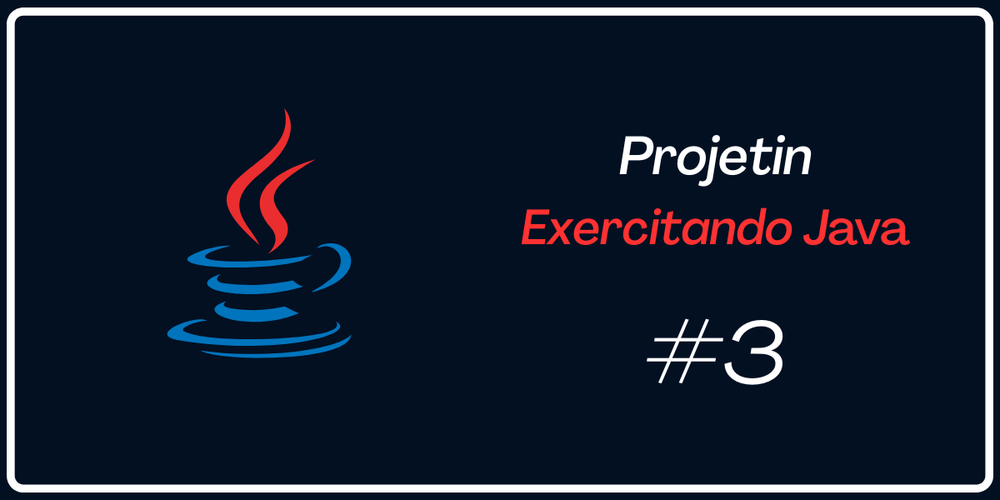

## 🚀 Apresentação
 
📍 Exercícios propostos e resolvidos para fixar o aprendizado da linguagem Java tais como, lógica de programação, algorítimo e Orientação á Objetos.
 
 

 

## 🛠️ Stacks e conhecimentos utilizados
 

* Estrutura de Repetição;
* Expressões Comparativas;
* Estrutura Condicional;
* Function ToString;
* Vetores
* Member Static

 

## 📦 Aplicando conceitos nos próximos Projetos
 

* Construtores;
* Sobrecarga;
* Encapsulamentos;
* Entre outros;
